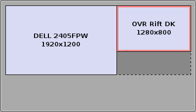

# RiftRay

Oculus Rift enabled viewer for the worlds of [Shadertoy](https://shadertoy.com). Tested on Windows, Mac and Linux, NVIDIA and AMD.

## Setup

### Mirrored Display

- Launch the executable from the bin/ directory.  
- Maximize the app window  
- Press F1 twice to enable Rift post-process distortion  

### Extended Display

  

- Set your monitor configuration as in the image above(1280x800+1920+0)  
- Launch the executable from the bin/ directory.  

## Controls  

### Hydra
####**Right controller** - Object rotation, scene control  
- **Bumper** - Hold to rotate object(by rotating controller)  
- **Button 1** - Hold to translate object(by translating controller)  
- **Joystick** - Move avatar in scene  
- **Stick press** - Reset object transformation  
- **Start** - Next shader

####**Left controller** - Rendering options, performance
- **Trigger** - Increase resolution, decrease FOV  
- **Joystick vertical** - Scale the base FBO resolution(before focus boost)  
- **Start** - Previous shader  
- **Button 1** - Toggle scene display in control view(the non-Oculus display if you are using extended desktop)  

### Gamepad
- **Dpad** - View direction yaw  
- **Buttons 1,2,3,4** - Forward, back, strafe left, right  
- **Left Shoulder buttons** - Rise, Fall  
- **Right Shoulder buttons** - Scale up,down FBO resolution  
- **Select, Start** - Previous, Next shader  

### Keyboard
- **WASD QE** - Navigate forward, back, strafe left, right, rise, fall  
- **Space** - Next shader  
- **Shift+Space**, **Backspace** - Previous shader  

### Mouse
- **Right click & drag** - Move avatar  
- **Forward, Back(if applicable)** - Next, Previous shader  
- **Wheel** - Increase resolution, decrease FOV  
- **Shift+Wheel** - Increase resolution  
- **Control+Wheel** - Head size  

Performance tweaks are available via AntTweakBar. VSync controls are provided via the Glfw library and their effectiveness may vary with hardware support.

## Acknowledgments

All shader code under shaders/shadertoy/ was written by the top developers in the field and is covered by the Creative Commons Attribution-NonCommercial-ShareAlike 3.0 Unported License <http://creativecommons.org/licenses/by-nc-sa/3.0/us/> unless stated otherwise in the code.  

### Huge Thanks to:
- Iñigo Quilez for [Shadertoy](https://shadertoy.com) and all the code and tutorials on his site [www.iquilezles.org](http://www.iquilezles.org/)  
- All the members of [Shadertoy](https://shadertoy.com) for their beautiful GLSL code  
- Mikael Hvidtfeldt Christensen for the blog [blog.hvidtfeldts.net](http://blog.hvidtfeldts.net/)  
- Micah Dedmon for Mac porting and packaging  
- elmindreda for the awesome [Glfw3 framework](https://github.com/glfw/glfw)   
- Palmer Luckey and Oculus for the [Oculus Rift and OVR SDK](http://www.oculusvr.com/)  
- Philip Rideout for the [excellent CMake/OpenGL code](http://github.prideout.net/)  
- Philippe Decaudin for [AntTweakBar](http://anttweakbar.sourceforge.net/doc/)  
- Milan Ikits and Marcelo Magallon for [GLEW](http://glew.sourceforge.net/)  
